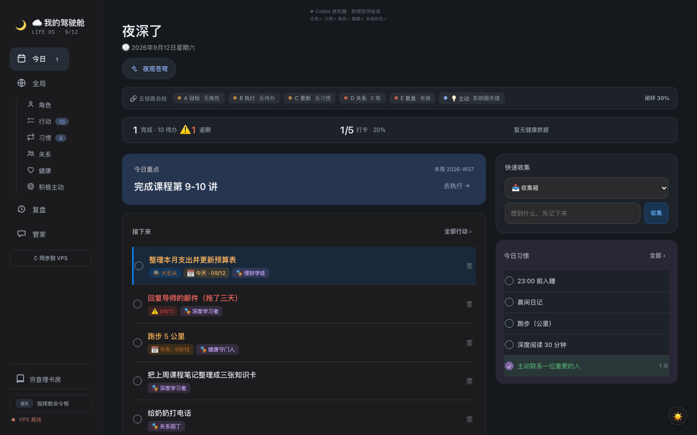
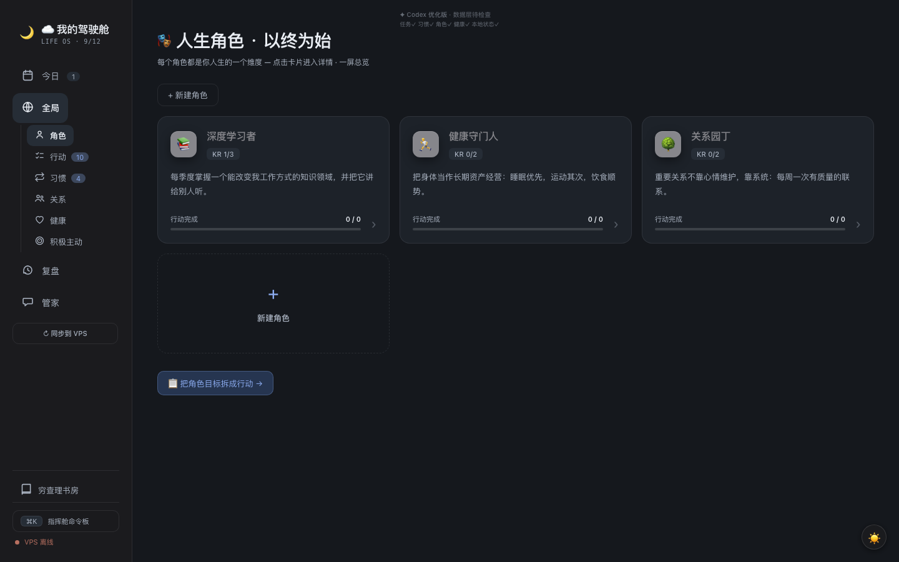
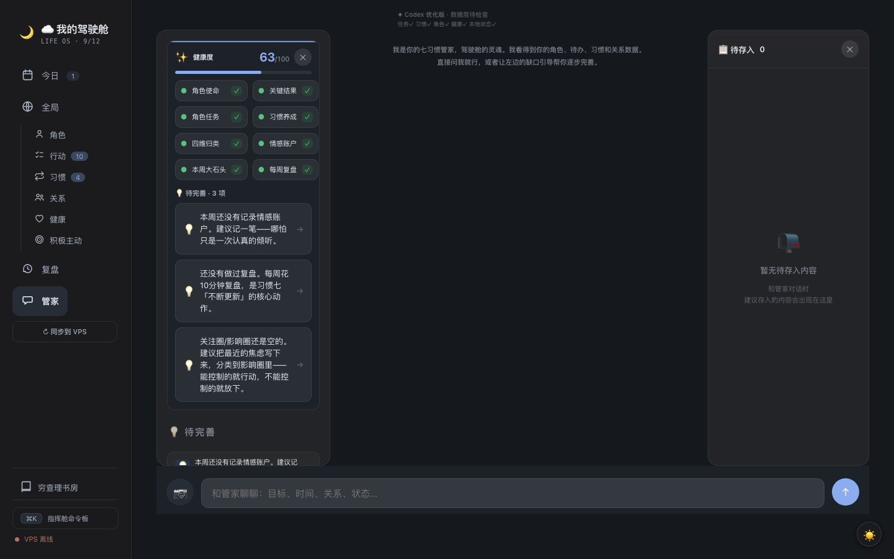

# My Life OS · 个人驾驶舱

> 一个**本地优先、原则驱动、AI 辅助**的个人生活操作系统：把角色、重要行动、习惯、关系、健康和复盘连接成每日闭环。

[]() []() []()







## 这是什么

大多数待办工具回答「今天做什么」，却从不问你「**为什么做**」。这个项目把个人管理拆成一条闭环：

```
角色（我看重什么）→ 关键结果 → 行动（要事第一）→ 习惯（持续投入）
   ↑                                        ↓
   └── 复盘（每周校准） ←── 关系/健康（别丢掉生活本身）
```

- **今日**：一屏看清状态 → 选大石头 → 打卡/收集，直接推动行动
- **角色**：每个人生角色一份档案（使命/季度目标/KR/洞察/复盘），Markdown 存储可随身带走
- **行动**：四象限 + 逾期/今日/优先级排序，写操作带权威回读（拒绝假成功）
- **习惯**：84 天热力图、连续天数、维度归因（身体/心智/关系…）
- **关系**：情感账户（存款/取款）+ 倾听笔记 + 影响圈/关注圈
- **健康**：Apple Watch 数据可选接入，睡眠/HRV/锻炼趋势 + 每日简报
- **复盘**：周完成曲线、角色平衡雷达、AI 辅助草稿
- **AI 管家**：读得见你全部数据的本地管家——动作白名单 + 人工确认 + 可撤销，绝无静默执行
- **观星模式**：从今日页进入沉浸星空，点击点亮星星，轮播仓库原创的每日提醒；支持 Esc 或返回按钮退出

设计受原则中心、角色平衡与重要性排序等经典自我管理思想启发（详见致谢）。**本项目与任何书籍、作者或机构无关，非官方产品。**

## 三步启动

```bash
# 1. 获取代码
git clone <本仓库> && cd dashboard-oss

# 2. 启动（无需任何配置，自动进入演示模式）
python3 dashboard-server.py 8787

# 3. 打开
# http://127.0.0.1:8787/
```

零 pip 依赖（纯 Python 标准库 + 原生前端）。首次启动看到的是**完全虚构的演示数据**：3 个角色、10 条任务、5 个习惯、关系与健康趋势——所有界面、交互、写操作链路都可体验。

## 离线演示模式

无 TickTick / 无健康设备 / 无 LLM / 无 Obsidian 时自动进入。想切换：

```bash
DASH_DEMO=1 python3 dashboard-server.py 8787   # 强制演示：独立临时数据，退出后清理
DASH_DEMO=0 python3 dashboard-server.py 8787   # 强制真实模式
```

**重置非强制演示数据**：先停止服务，再将 `data/` 移到备份位置；下次启动会重新初始化。`DASH_DEMO=1` 使用独立临时目录，退出后自动清理。

```bash
mv data "data.backup.$(date +%Y%m%d-%H%M%S)"   # 或者换个 DASH_DATA_DIR
```

## 可选集成（全部按需，不配不影响运行）

| 能力 | 配置（`config` 文件或环境变量） | 不配时 |
|---|---|---|
| 任务/习惯真实数据 | `TICKTICK_TOKEN` + `PROJECT_IDS` | 演示数据 |
| AI 管家/顾问/神谕 | `LLM_API_BASE` / `LLM_API_KEY` / `LLM_MODEL`（可选 `LLM_FALLBACK`） | 规则模式兜底，界面完整 |
| 看图理解 | 与 AI 功能共用 `LLM_API_BASE` / `LLM_API_KEY` | 本机拒绝上传并提示未配置 |
| 微信推送提醒 | `WECHAT_DELIVER` | 提醒仅本地记录 |
| 健康数据 | 将 `DASH_DATA_DIR` 指向兼容的健康数据目录；本仓库不附带推送接收器 | 健康页显示演示趋势 |
| 界面称呼 | `USER_NAME` | 「用户」 |

配置文件查找顺序：`DASH_CONFIG` 环境变量 → 项目目录 `./config`。不会自动读取主目录配置；`DASH_DEMO=1` 不读取配置文件。远端画像同步默认关闭，仅显式设置 `DASH_PROFILE_SYNC=1` 且非演示模式时启用。示例见 `deploy/.env.example`。

## 架构

```
浏览器（单页前端 hermes-dashboard.html + PWA/SW）
   │  REST + SSE
Python 单进程后端（dashboard-server.py，标准库实现）
   ├─ TickTick MCP API     ── 任务/习惯（可选）
   ├─ 本地 Markdown/JSON   ── 角色/关系/倾听/影响圈（data/ 目录）
   ├─ 健康数据目录          ── Apple Watch 数据读取与诊断（接收器需自行实现）
   └─ 你自己的 LLM 服务    ── 管家/顾问/神谕（可选，OpenAI 兼容协议）
```

核心工程决策（详见 `docs/`）：
- **写契约**：幂等账本（clientMutationId）+ 权威回读 + 乐观回滚，杜绝「假成功」
- **数据安全**：原子写、损坏保护、软删除 7 天可恢复、恢复快照
- **AI 边界**：动作白名单 + 人工确认 + 审计 + 撤销栈，AI 永远不能静默改你的数据（见 PRIVACY.md）

## 当前限制（v0.1）

- 单用户设计，无账号体系（本地优先是特性不是缺陷）
- 移动端 Safari 真机验证仍需由维护者在真实设备完成（`docs/manual-device-test.md`）；Chromium 触控模拟不等同于 Safari 证明
- TickTick 是目前唯一任务后端（架构上 MCP 协议可扩展）
- 复盘/角色数据在 Markdown，暂无导入导出向导（文件即数据，可手动迁移）
- 视觉为作者个人偏好，主题系统待完善

## 文档

- [PRIVACY.md](PRIVACY.md) —— AI 到底能看到你什么数据（字段级）
- [SECURITY.md](SECURITY.md) —— 部署安全须知
- [CONTRIBUTING.md](CONTRIBUTING.md)
- [docs/api-contracts.md](docs/api-contracts.md) · [docs/data-flow.md](docs/data-flow.md) · [docs/data-consistency.md](docs/data-consistency.md) · [docs/deployment.md](docs/deployment.md)

## License

Apache-2.0（见 [LICENSE](LICENSE)）。

## 致谢

项目的设计思想受益于广泛流传的自我管理原则——以角色定义人生方向、按重要性而非紧急性排序行动、在产出与产能之间保持平衡。这些思想不属于某一本特定的书；本项目也不是任何书籍或其作者的官方产品。同时感谢开源社区提供的 Chart.js 等基础库。
